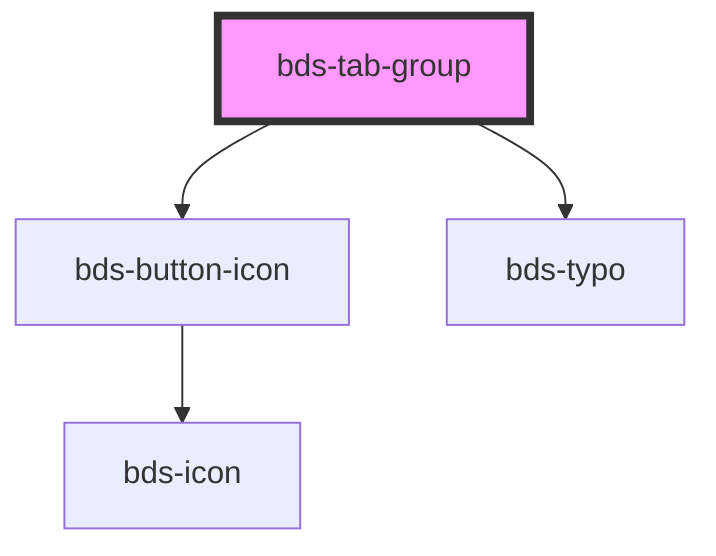

# bds-tab-group

<!-- Auto Generated Below -->

## Properties

| Property     | Attribute    | Description | Type      | Default |
| ------------ | ------------ | ----------- | --------- | ------- |
| `scrollable` | `scrollable` |             | `boolean` | `false` |

## Events

| Event          | Description                                                   | Type               |
| -------------- | ------------------------------------------------------------- | ------------------ |
| `bdsTabChange` | bdsTabChange. Event to return value when accordion is change. | `CustomEvent<any>` |

## Dependencies

### Depends on

- [bds-button-icon](../../icon-button)
- [bds-typo](../../typo)

### Graph

----------------------------------------------

*Built with [StencilJS](https://stenciljs.com/)*
