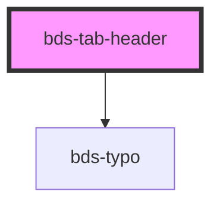

# bds-tab-header

<!-- Auto Generated Below -->

## Properties

| Property | Attribute | Description | Type      | Default                                    |
| -------- | --------- | ----------- | --------- | ------------------------------------------ |
| `active` | `active`  |             | `boolean` | `false`                                    |
| `id`     | `id`      |             | `string`  | `Math.random().toString(36).substr(2, 10)` |
| `name`   | `name`    |             | `string`  | `undefined`                                |

## Events

| Event       | Description | Type               |
| ----------- | ----------- | ------------------ |
| `bdsSelect` |             | `CustomEvent<any>` |

## Methods

### `getChild() => Promise<BdsTabHeaderData>`

#### Returns

Type: `Promise<BdsTabHeaderData>`

## Dependencies

### Depends on

- [bds-typo](../../typo)

### Graph

----------------------------------------------

*Built with [StencilJS](https://stenciljs.com/)*
