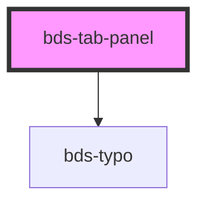

# bds-tab-panel

<!-- Auto Generated Below -->

## Properties

| Property             | Attribute | Description                                               | Type     | Default     |
| -------------------- | --------- | --------------------------------------------------------- | -------- | ----------- |
| `group` _(required)_ | `group`   | Specifies the TabPanel group. Used to link it to the Tab. | `string` | `undefined` |

## Dependencies

### Depends on

- [bds-typo](../../typo)

### Graph

----------------------------------------------

*Built with [StencilJS](https://stenciljs.com/)*
