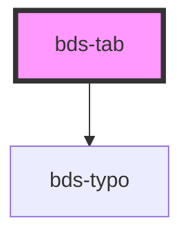

# bds-tab

<!-- Auto Generated Below -->

## Properties

| Property             | Attribute | Description                                               | Type      | Default     |
| -------------------- | --------- | --------------------------------------------------------- | --------- | ----------- |
| `active`             | `active`  |                                                           | `boolean` | `false`     |
| `group` _(required)_ | `group`   | Specifies the Tab group. Used to link it to the TabPanel. | `string`  | `undefined` |
| `label` _(required)_ | `label`   |                                                           | `string`  | `undefined` |

## Events

| Event          | Description | Type               |
| -------------- | ----------- | ------------------ |
| `bdsSelectTab` |             | `CustomEvent<any>` |

## Dependencies

### Depends on

- [bds-typo](../../typo)

### Graph

----------------------------------------------

*Built with [StencilJS](https://stenciljs.com/)*
