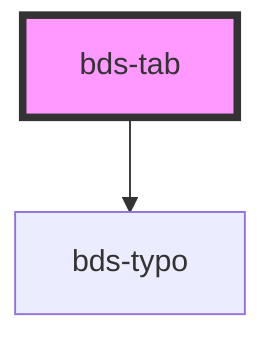

# bds-tab

<!-- Auto Generated Below -->

## Properties

| Property             | Attribute | Description                                                   | Type      | Default     |
| -------------------- | --------- | ------------------------------------------------------------- | --------- | ----------- |
| `active`             | `active`  | Prop to control externally if a tab will be active by default | `boolean` | `false`     |
| `group` _(required)_ | `group`   | Specifies the Tab group. Used to link it to the TabPanel.     | `string`  | `undefined` |
| `label` _(required)_ | `label`   | The text to be shown at the Tab                               | `string`  | `undefined` |

## Events

| Event          | Description                                          | Type               |
| -------------- | ---------------------------------------------------- | ------------------ |
| `bdsTabChange` | Event to emmit when the active tab should be updated | `CustomEvent<any>` |

## Dependencies

### Depends on

- [bds-typo](../../typo)

### Graph

----------------------------------------------

*Built with [StencilJS](https://stenciljs.com/)*
