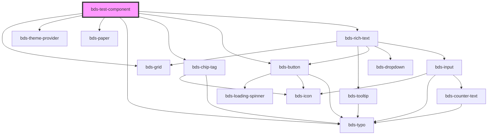

# bds-test-component

<!-- Auto Generated Below -->

## Dependencies

### Depends on

- [bds-grid](../grid)
- [bds-theme-provider](../theme-provider)
- [bds-paper](../paper)
- [bds-typo](../typo)
- [bds-chip-tag](../chip-tag)
- [bds-button](../button)
- [bds-rich-text](../rict-text)

### Graph

----------------------------------------------

*Built with [StencilJS](https://stenciljs.com/)*
