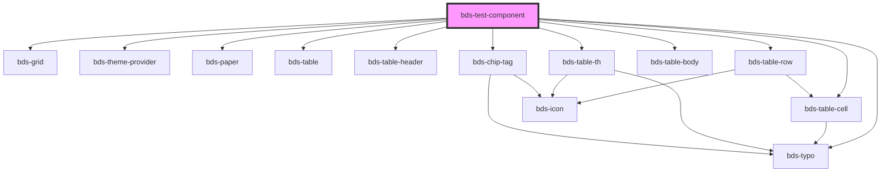

# bds-test-component

<!-- Auto Generated Below -->

## Dependencies

### Depends on

- [bds-grid](../grid)
- [bds-typo](../typo)
- [bds-theme-provider](../theme-provider)
- [bds-paper](../paper)
- [bds-table](../table/table)
- [bds-table-header](../table/table-header)
- [bds-table-row](../table/table-row)
- [bds-table-th](../table/table-header-cell)
- [bds-table-body](../table/table-body)
- [bds-table-cell](../table/table-cell)
- [bds-chip-tag](../chip-tag)

### Graph

----------------------------------------------

*Built with [StencilJS](https://stenciljs.com/)*
