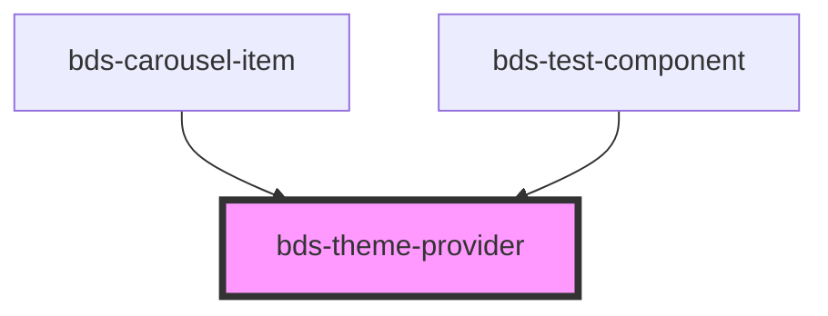

# bds-theme-provider

<!-- Auto Generated Below -->

## Properties

| Property | Attribute | Description                                                          | Type                                   | Default   |
| -------- | --------- | -------------------------------------------------------------------- | -------------------------------------- | --------- |
| `theme`  | `theme`   | Set what theme will be aplyed inside the component. 'light', 'dark'; | `"dark" \| "high-contrast" \| "light"` | `'light'` |

## Dependencies

### Used by

 - [bds-carousel-item](../carousel)
 - [bds-test-component](../test-component)

### Graph

----------------------------------------------

*Built with [StencilJS](https://stenciljs.com/)*
