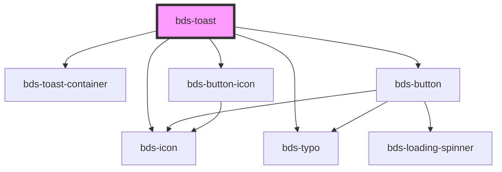

# bds-toast

<!-- Auto Generated Below -->

## Properties

| Property         | Attribute          | Description                                                                                                                                                                                                                                              | Type                                                                                  | Default         |
| ---------------- | ------------------ | -------------------------------------------------------------------------------------------------------------------------------------------------------------------------------------------------------------------------------------------------------- | ------------------------------------------------------------------------------------- | --------------- |
| `actionType`     | `action-type`      | ActionType. Defines if the button should have a button or an icon. Can be one of: 'icon', 'button';                                                                                                                                                      | `"button" \| "icon"`                                                                  | `'button'`      |
| `buttonAction`   | `button-action`    | Define an action to the button toast. Can be one of: 'close', 'custom'; if the action type is set to close, the button will close automatically. if the action type is set to custom, a function need to be passed when the toastButtonClick is emitted. | `"close" \| "custom"`                                                                 | `'close'`       |
| `buttonText`     | `button-text`      | If the action type is button, this will be the text of the button:                                                                                                                                                                                       | `string`                                                                              | `undefined`     |
| `dtButtonAction` | `dt-button-action` | Data test is the prop to specifically test the component action object. dtButtonAction is the data-test to button action.                                                                                                                                | `string`                                                                              | `null`          |
| `dtButtonClose`  | `dt-button-close`  | Data test is the prop to specifically test the component action object. dtButtonClose is the data-test to button close.                                                                                                                                  | `string`                                                                              | `null`          |
| `duration`       | `duration`         | Time to close the toast in seconds 0 = never close automatically (default value)                                                                                                                                                                         | `number`                                                                              | `0`             |
| `hide`           | `hide`             | Controls the hide event of the component:                                                                                                                                                                                                                | `boolean`                                                                             | `false`         |
| `icon`           | `icon`             | used for add the icon. Uses the bds-icon component.                                                                                                                                                                                                      | `string`                                                                              | `null`          |
| `position`       | `position`         | The toast position on the screen. Can be one of: 'top-right', 'top-left', 'bottom-right', 'bottom-left' (default value);                                                                                                                                 | `"bottom-left" \| "bottom-right" \| "top-left" \| "top-right"`                        | `'bottom-left'` |
| `show`           | `show`             | Controls the open event of the component:                                                                                                                                                                                                                | `boolean`                                                                             | `false`         |
| `toastText`      | `toast-text`       | The text content of the component:                                                                                                                                                                                                                       | `string`                                                                              | `undefined`     |
| `toastTitle`     | `toast-title`      | The title of the component:                                                                                                                                                                                                                              | `string`                                                                              | `undefined`     |
| `variant`        | `variant`          | Variant. Defines the color of the toast. Can be one of: 'system', 'error', 'success', 'warning', 'undo', 'redo';                                                                                                                                         | `"error" \| "notification" \| "redo" \| "success" \| "system" \| "undo" \| "warning"` | `'system'`      |

## Events

| Event              | Description                                                                      | Type               |
| ------------------ | -------------------------------------------------------------------------------- | ------------------ |
| `toastButtonClick` | Event used to execute some action when the action button on the toast is clicked | `CustomEvent<any>` |

## Methods

### `close() => Promise<void>`

Can be used outside the component to close the toast

#### Returns

Type: `Promise<void>`

### `create({ actionType, buttonAction, buttonText, icon, toastText, toastTitle, variant, duration, }: CreateToastType) => Promise<void>`

Can be used outside to open the toast

#### Parameters

| Name  | Type                                                                                                                                                                                                          | Description |
| ----- | ------------------------------------------------------------------------------------------------------------------------------------------------------------------------------------------------------------- | ----------- |
| `__0` | `{ buttonAction?: ButtonActionType; buttonText?: string; toastText: string; toastTitle: string; icon?: string; actionType?: ActionType; variant?: VariantType; duration?: number; position?: PositionType; }` |             |

#### Returns

Type: `Promise<void>`

## Dependencies

### Depends on

- [bds-toast-container](../toast-container)
- [bds-icon](../icon)
- [bds-typo](../typo)
- [bds-button](../button)
- [bds-button-icon](../icon-button)

### Graph

----------------------------------------------

*Built with [StencilJS](https://stenciljs.com/)*
