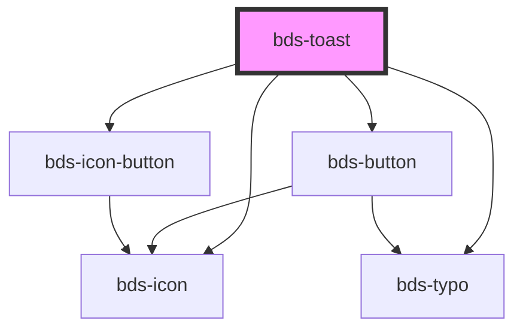

# bds-toast

<!-- Auto Generated Below -->

## Properties

| Property       | Attribute       | Description                                                                                         | Type                                            | Default     |
| -------------- | --------------- | --------------------------------------------------------------------------------------------------- | ----------------------------------------------- | ----------- |
| `actionType`   | `action-type`   | ActionType. Defines if the button should have a button or an icon. Can be one of: 'icon', 'button'; | `"button" \| "icon"`                            | `"icon"`    |
| `buttonAction` | `button-action` | Define an action to the button toast                                                                | `"close" \| "custom"`                           | `"custom"`  |
| `buttonText`   | `button-text`   | If the action type is button, this will be the text of the button:                                  | `string`                                        | `undefined` |
| `duration`     | `duration`      | Time to close the toast in seconds 0 = no auto close (default value)                                | `number`                                        | `0`         |
| `icon`         | `icon`          | used for add the icon. Uses the bds-icon component.                                                 | `string`                                        | `null`      |
| `text`         | `text`          | The text content of the component:                                                                  | `string`                                        | `undefined` |
| `toastName`    | `toast-name`    | used for add the icon. Uses the bds-icon component.                                                 | `string`                                        | `null`      |
| `toastTitle`   | `toast-title`   | The title of the component:                                                                         | `string`                                        | `undefined` |
| `variant`      | `variant`       | Variant. Defines the color of the toast. Can be one of: 'system', 'error', 'success', 'warning';    | `"error" \| "success" \| "system" \| "warning"` | `"system"`  |

## Events

| Event              | Description                                                                      | Type               |
| ------------------ | -------------------------------------------------------------------------------- | ------------------ |
| `toastButtonClick` | Event used to execute some action when the action button on the toast is clicked | `CustomEvent<any>` |

## Methods

### `close(event: any) => Promise<void>`

Can be used outside the component to close the toast

#### Returns

Type: `Promise<void>`

### `open() => Promise<void>`

Can be used outside to open the toast

#### Returns

Type: `Promise<void>`

## Dependencies

### Depends on

- [bds-icon](../icon)
- [bds-typo](../typo)
- [bds-button](../button)
- [bds-icon-button](../icon-button)

### Graph

----------------------------------------------

*Built with [StencilJS](https://stenciljs.com/)*
