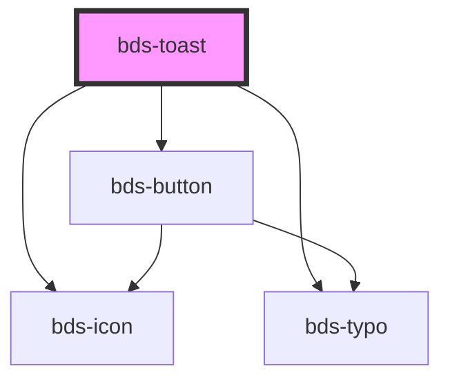

# bds-toast

<!-- Auto Generated Below -->

## Properties

| Property     | Attribute     | Description                                                                                          | Type                                            | Default     |
| ------------ | ------------- | ---------------------------------------------------------------------------------------------------- | ----------------------------------------------- | ----------- |
| `actionType` | `action-type` | ActionType. Defines if the button should have a button or an icon. Can be one of:  'icon', 'button'; | `"button" \| "icon"`                            | `'icon'`    |
| `buttonText` | `button-text` | If the action type is button, this will be the text of the button:                                   | `string`                                        | `undefined` |
| `icon`       | `icon`        | used for add the icon. Uses the bds-icon component.                                                  | `string`                                        | `null`      |
| `text`       | `text`        | The text content of the component:                                                                   | `string`                                        | `undefined` |
| `toastTitle` | `toast-title` | The title of the component:                                                                          | `string`                                        | `undefined` |
| `variant`    | `variant`     | Variant. Defines the color of the toast. Can be one of:  'system', 'error', 'success', 'warning';    | `"error" \| "success" \| "system" \| "warning"` | `'system'`  |

## Methods

### `open() => Promise<void>`

Can be used outside to open the toast

#### Returns

Type: `Promise<void>`

## Dependencies

### Depends on

- [bds-icon](../icon)
- [bds-typo](../typo)
- [bds-button](../button)

### Graph

----------------------------------------------

*Built with [StencilJS](https://stenciljs.com/)*
