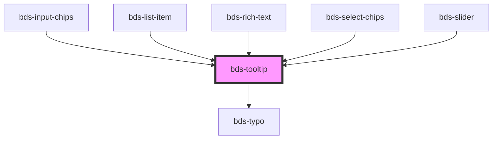

# bds-tooltip

<!-- Auto Generated Below -->

## Properties

| Property      | Attribute      | Description                                                             | Type                                                                                                                                                                                                 | Default         |
| ------------- | -------------- | ----------------------------------------------------------------------- | ---------------------------------------------------------------------------------------------------------------------------------------------------------------------------------------------------- | --------------- |
| `dataTest`    | `data-test`    | Data test is the prop to specifically test the component action object. | `string`                                                                                                                                                                                             | `null`          |
| `disabled`    | `disabled`     | Used to disable tooltip when the button are avalible                    | `boolean`                                                                                                                                                                                            | `false`         |
| `maxWidth`    | `max-width`    | Used to set tooltip max width                                           | `string`                                                                                                                                                                                             | `'320px'`       |
| `position`    | `position`     | Used to set tooltip position                                            | `"bottom-center" \| "bottom-left" \| "bottom-right" \| "left-bottom" \| "left-center" \| "left-top" \| "right-bottom" \| "right-center" \| "right-top" \| "top-center" \| "top-left" \| "top-right"` | `'left-center'` |
| `tooltipText` | `tooltip-text` | Used to set tooltip text                                                | `string`                                                                                                                                                                                             | `'Tooltip'`     |

## Methods

### `invisible() => Promise<void>`

Method for change the visibility of tooltip.

#### Returns

Type: `Promise<void>`

### `visible() => Promise<void>`

Method for change the visibility of tooltip.

#### Returns

Type: `Promise<void>`

## Dependencies

### Used by

 - [bds-input-chips](../input-chips)
 - [bds-list-item](../list)
 - [bds-rich-text](../rict-text)
 - [bds-select-chips](../selects/select-chips)
 - [bds-slider](../slider)

### Depends on

- [bds-typo](../typo)

### Graph

----------------------------------------------

*Built with [StencilJS](https://stenciljs.com/)*
