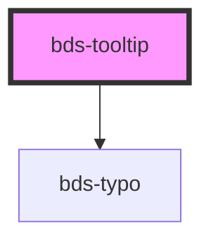

# bds-tooltip

<!-- Auto Generated Below -->

## Properties

| Property      | Attribute      | Description          | Type                                                                                                                                                                     | Default     |
| ------------- | -------------- | -------------------- | ------------------------------------------------------------------------------------------------------------------------------------------------------------------------ | ----------- |
| `position`    | `position`     | Tooltip content text | `"bottom" \| "bottom-left" \| "bottom-right" \| "left" \| "left-bottom" \| "left-top" \| "right" \| "right-bottom" \| "right-top" \| "top" \| "top-left" \| "top-right"` | `'left'`    |
| `tooltipText` | `tooltip-text` | Tooltip content text | `string`                                                                                                                                                                 | `'Tooltip'` |

## Dependencies

### Depends on

- [bds-typo](../typo)

### Graph

----------------------------------------------

*Built with [StencilJS](https://stenciljs.com/)*
