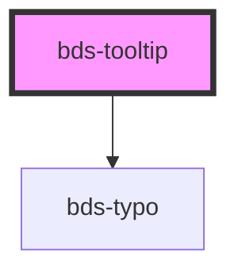

# bds-tooltip

<!-- Auto Generated Below -->

## Properties

| Property      | Attribute      | Description                                          | Type                                                                                                                                                                                                 | Default         |
| ------------- | -------------- | ---------------------------------------------------- | ---------------------------------------------------------------------------------------------------------------------------------------------------------------------------------------------------- | --------------- |
| `disabled`    | `disabled`     | Used to disable tooltip when the button are avalible | `boolean`                                                                                                                                                                                            | `false`         |
| `position`    | `position`     | Used to set tooltip position                         | `"bottom-center" \| "bottom-left" \| "bottom-right" \| "left-bottom" \| "left-center" \| "left-top" \| "right-bottom" \| "right-center" \| "right-top" \| "top-center" \| "top-left" \| "top-right"` | `'left-center'` |
| `tooltipText` | `tooltip-text` | Used to set tooltip text                             | `string`                                                                                                                                                                                             | `'Tooltip'`     |

## Dependencies

### Depends on

- [bds-typo](../typo)

### Graph

----------------------------------------------

*Built with [StencilJS](https://stenciljs.com/)*
