# bds-typo

<!-- Auto Generated Below -->

## Properties

| Property     | Attribute     | Description                                                                                                                              | Type                                                                                   | Default   |
| ------------ | ------------- | ---------------------------------------------------------------------------------------------------------------------------------------- | -------------------------------------------------------------------------------------- | --------- |
| `bold`       | `bold`        | Bold. Entered as one of the bold. Can be one of: 'regular', 'semi-bold', 'bold', 'extra-bold';                                           | `"bold" \| "extra-bold" \| "regular" \| "semi-bold"`                                   | `null`    |
| `italic`     | `italic`      | Added font style italic                                                                                                                  | `boolean`                                                                              | `false`   |
| `lineHeight` | `line-height` | Line Height. Entered as one of the line hieght. Can be one of: 'none', 'small', 'simple', 'plus', 'double'                               | `"double" \| "none" \| "plus" \| "simple" \| "small"`                                  | `null`    |
| `margin`     | `margin`      | If true, adds default margin values                                                                                                      | `boolean`                                                                              | `true`    |
| `noWrap`     | `no-wrap`     | Added style no wrap                                                                                                                      | `boolean`                                                                              | `false`   |
| `paragraph`  | `paragraph`   | Tranform text in paragraph                                                                                                               | `boolean`                                                                              | `false`   |
| `tag`        | `tag`         | Define element tag, must be used for acessibilty                                                                                         | `"h1" \| "h2" \| "h3" \| "h4" \| "p" \| "span"`                                        | `'p'`     |
| `variant`    | `variant`     | Variant. Entered as one of the font size variant. Can be one of: 'fs-10' ,'fs-12' ,'fs-14' ,'fs-16' ,'fs-20' ,'fs-24' ,'fs-32' ,'fs-40'; | `"fs-10" \| "fs-12" \| "fs-14" \| "fs-16" \| "fs-20" \| "fs-24" \| "fs-32" \| "fs-40"` | `'fs-16'` |

## Shadow Parts

| Part               | Description |
| ------------------ | ----------- |
| `"bds-typo__text"` |             |

## Dependencies

### Used by

 - [bds-alert-body](../alert/alert-body)
 - [bds-alert-header](../alert/alert-header)
 - [bds-avatar](../avatar)
 - [bds-button](../button)
 - [bds-card-color](../card-color)
 - [bds-checkbox](../checkbox)
 - [bds-chip-clickable](../chip-clickable)
 - [bds-chip-tag](../chip-tag)
 - [bds-counter-text](../counter-text)
 - [bds-datepicker](../datepicker)
 - [bds-datepicker-period](../datepicker/datepicker-period)
 - [bds-datepicker-single](../datepicker/datepicker-single)
 - [bds-expansion-panel-header](../expansion-panel/expansion-panel-header)
 - [bds-input](../input)
 - [bds-input-editable](../input-editable)
 - [bds-input-phone-number](../input-phone-number)
 - [bds-menu-action](../menu/menu-action)
 - [bds-menu-exibition](../menu/menu-exibition)
 - [bds-menu-list-item](../menu-list-item)
 - [bds-menu-separation](../menu/menu-separation)
 - [bds-progress-bar](../progress-bar)
 - [bds-radio](../radio)
 - [bds-select-option](../select-option)
 - [bds-step](../stepper/step)
 - [bds-tab](../tabs/tab)
 - [bds-tab-panel](../tabs/tab-panel)
 - [bds-toast](../toast)
 - [bds-tooltip](../tooltip)
 - [bds-warning](../warning)

### Graph

```mermaid
graph TD;
  bds-alert-body --> bds-typo
  bds-alert-header --> bds-typo
  bds-avatar --> bds-typo
  bds-button --> bds-typo
  bds-card-color --> bds-typo
  bds-checkbox --> bds-typo
  bds-chip-clickable --> bds-typo
  bds-chip-tag --> bds-typo
  bds-counter-text --> bds-typo
  bds-datepicker --> bds-typo
  bds-datepicker-period --> bds-typo
  bds-datepicker-single --> bds-typo
  bds-expansion-panel-header --> bds-typo
  bds-input --> bds-typo
  bds-input-editable --> bds-typo
  bds-input-phone-number --> bds-typo
  bds-menu-action --> bds-typo
  bds-menu-exibition --> bds-typo
  bds-menu-list-item --> bds-typo
  bds-menu-separation --> bds-typo
  bds-progress-bar --> bds-typo
  bds-radio --> bds-typo
  bds-select-option --> bds-typo
  bds-step --> bds-typo
  bds-tab --> bds-typo
  bds-tab-panel --> bds-typo
  bds-toast --> bds-typo
  bds-tooltip --> bds-typo
  bds-warning --> bds-typo
  style bds-typo fill:#f9f,stroke:#333,stroke-width:4px
```

----------------------------------------------

*Built with [StencilJS](https://stenciljs.com/)*
