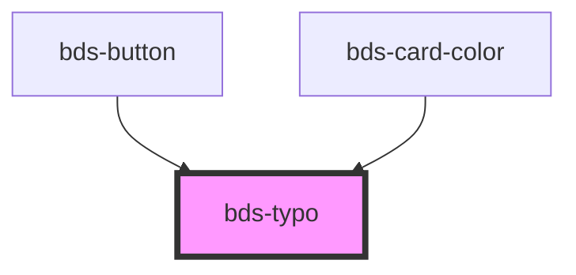

# bds-typo

<!-- Auto Generated Below -->

## Properties

| Property     | Attribute     | Description                                                                                                                               | Type                                                                                   | Default   |
| ------------ | ------------- | ----------------------------------------------------------------------------------------------------------------------------------------- | -------------------------------------------------------------------------------------- | --------- |
| `bold`       | `bold`        | Bold. Entered as one of the bold. Can be one of:  'regular', 'semi-bold', 'bold', 'extra-bold';                                           | `"bold" \| "extra-bold" \| "regular" \| "semi-bold"`                                   | `null`    |
| `italic`     | `italic`      | Added font style italic                                                                                                                   | `boolean`                                                                              | `false`   |
| `lineHeight` | `line-height` | Line Height. Entered as one of the line hieght. Can be one of:  'none', 'small', 'simple', 'plus', 'double'                               | `"double" \| "none" \| "plus" \| "simple" \| "small"`                                  | `null`    |
| `noWrap`     | `no-wrap`     | Added style no wrap                                                                                                                       | `boolean`                                                                              | `false`   |
| `paragraph`  | `paragraph`   | Tranform text in paragraph                                                                                                                | `boolean`                                                                              | `false`   |
| `tag`        | `tag`         | Define element tag, must be used for acessibilty                                                                                          | `"h1" \| "h2" \| "h3" \| "h4" \| "p"`                                                  | `'p'`     |
| `variant`    | `variant`     | Variant. Entered as one of the font size variant. Can be one of:  'fs-10' ,'fs-12' ,'fs-14' ,'fs-16' ,'fs-20' ,'fs-24' ,'fs-32' ,'fs-40'; | `"fs-10" \| "fs-12" \| "fs-14" \| "fs-16" \| "fs-20" \| "fs-24" \| "fs-32" \| "fs-40"` | `'fs-16'` |

## Dependencies

### Used by

 - [bds-button](../button)
 - [bds-card-color](../card-color)

### Graph

----------------------------------------------

*Built with [StencilJS](https://stenciljs.com/)*
