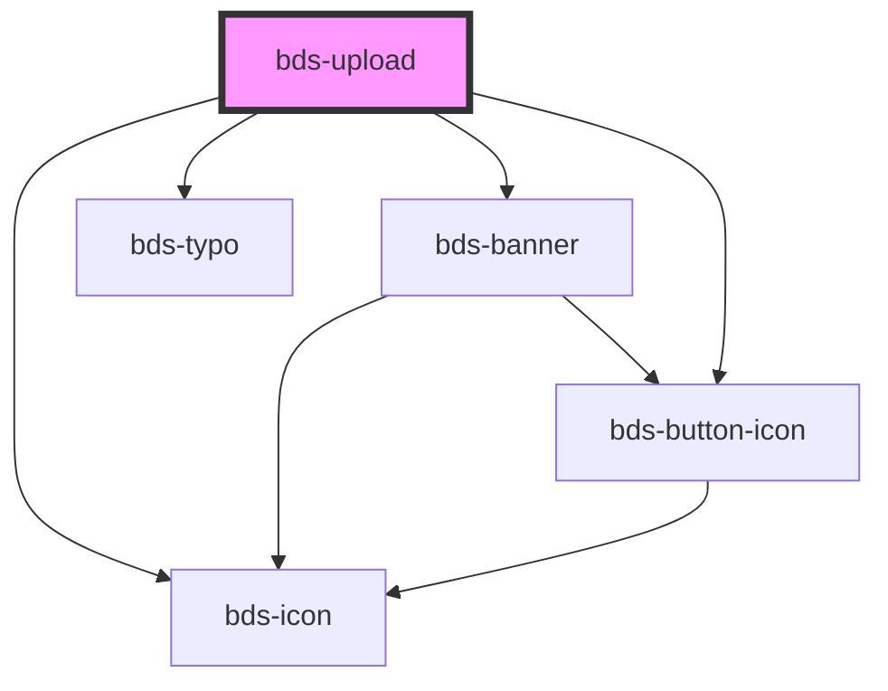

# bds-upload

<!-- Auto Generated Below -->

## Properties

| Property         | Attribute           | Description                                                                                                              | Type                            | Default     |
| ---------------- | ------------------- | ------------------------------------------------------------------------------------------------------------------------ | ------------------------------- | ----------- |
| `accept`         | `accept`            | Used to accept a especific type of file.                                                                                 | `string`                        | `undefined` |
| `dataAccept`     | `data-accept`       | Used to accept a especific type of file.                                                                                 | `string \| string[]`            | `[]`        |
| `dtButtonDelete` | `dt-button-delete`  | Data test is the prop to specifically test the component action object. dtButtonDelete is the data-test to button clear. | `string`                        | `null`      |
| `dtInputFiles`   | `dt-input-files`    | Data test is the prop to specifically test the component action object. dtInputFiles is the data-test to button clear.   | `string`                        | `null`      |
| `dtLabelAddFile` | `dt-label-add-file` | Data test is the prop to specifically test the component action object. dtLabelAddFile is the data-test to button clear. | `string`                        | `null`      |
| `error`          | `error`             | Used for add a error message. In case a verify.                                                                          | `string`                        | `undefined` |
| `language`       | `language`          | Set the language for fixed texts.                                                                                        | `"en_US" \| "es_ES" \| "pt_BR"` | `'pt_BR'`   |
| `multiple`       | `multiple`          | Used to allow upload multiple files.                                                                                     | `boolean`                       | `undefined` |
| `subtitle`       | `subtitle`          | Used for add a text on subtitle.                                                                                         | `string`                        | `undefined` |
| `titleName`      | `title-name`        | Used for add a text on title.                                                                                            | `string`                        | `undefined` |

## Events

| Event             | Description                                    | Type               |
| ----------------- | ---------------------------------------------- | ------------------ |
| `bdsUploadChange` | Event emited when change the value of Upload.  | `CustomEvent<any>` |
| `bdsUploadDelete` | Event emited when delete a item from the list. | `CustomEvent<any>` |

## Methods

### `deleteAllFiles() => Promise<void>`

Used for delete a item from the list.

#### Returns

Type: `Promise<void>`

### `deleteFile(index: any) => Promise<void>`

Used for delete a item from the list.

#### Parameters

| Name    | Type  | Description |
| ------- | ----- | ----------- |
| `index` | `any` |             |

#### Returns

Type: `Promise<void>`

## Dependencies

### Depends on

- [bds-icon](../icon)
- [bds-typo](../typo)
- [bds-banner](../banner)
- [bds-button-icon](../icon-button)

### Graph

----------------------------------------------

*Built with [StencilJS](https://stenciljs.com/)*
