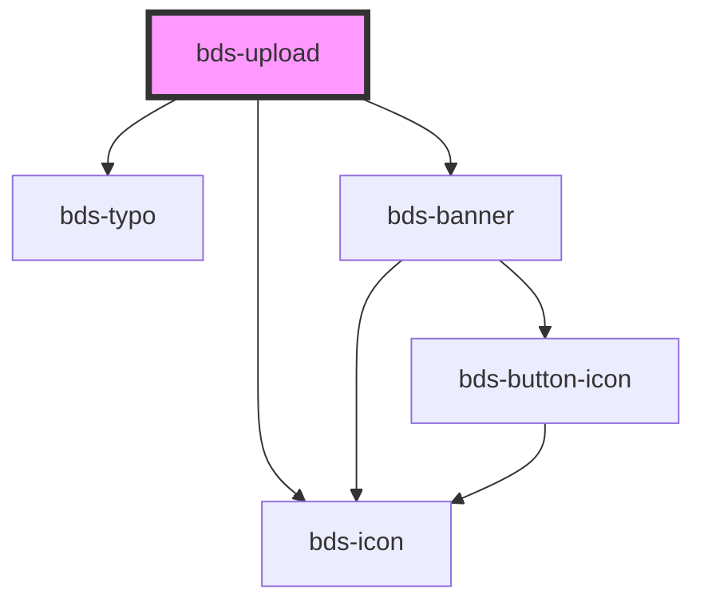

# bds-upload

<!-- Auto Generated Below -->

## Properties

| Property    | Attribute    | Description                                     | Type      | Default     |
| ----------- | ------------ | ----------------------------------------------- | --------- | ----------- |
| `accept`    | `accept`     | Used to accept a especific type of file.        | `string`  | `undefined` |
| `error`     | `error`      | Used for add a error message. In case a verify. | `string`  | `undefined` |
| `multiple`  | `multiple`   | Used to allow upload multiple files.            | `boolean` | `undefined` |
| `subtitle`  | `subtitle`   | Used for add a text on subtitle.                | `string`  | `undefined` |
| `titleName` | `title-name` | Used for add a text on title.                   | `string`  | `undefined` |

## Events

| Event             | Description                                    | Type               |
| ----------------- | ---------------------------------------------- | ------------------ |
| `bdsUploadChange` | Event emited when change the value of Upload.  | `CustomEvent<any>` |
| `bdsUploadDelete` | Event emited when delete a item from the list. | `CustomEvent<any>` |

## Dependencies

### Depends on

- [bds-icon](../icon)
- [bds-typo](../typo)
- [bds-banner](../banner)

### Graph

----------------------------------------------

*Built with [StencilJS](https://stenciljs.com/)*
